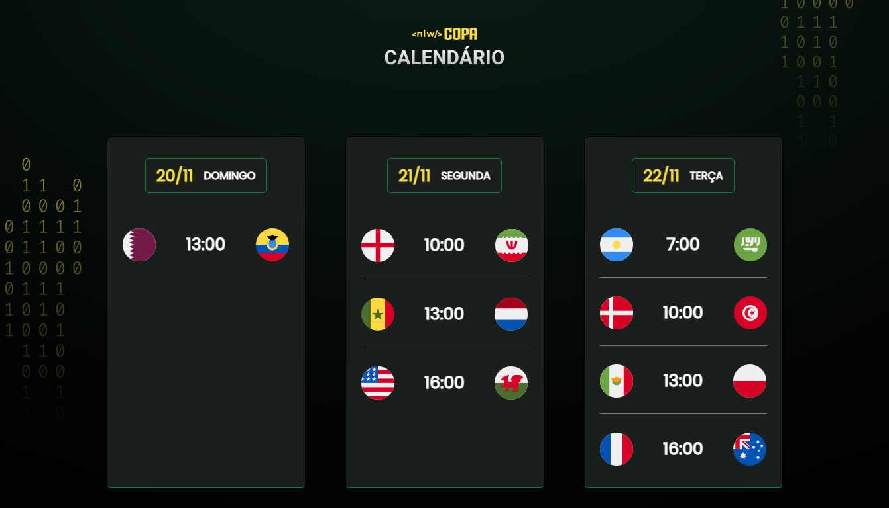

<h1 align="center"> Calendário da Copa do mundo 2022 </h1>

Projeto realizado na semana da NLW da Rocketseat.

  

## 🚀 Tecnologias

Esse projeto foi desenvolvido com as seguintes tecnologias:

- HTML, CSS e JavaScript

## 💻 Projeto

O calendário da copa é um projeto que mostra os  jogos da copa do mundo de 2022.

## 🔖 Layout

Link para visualizar o projeto: https://vitorarimatea.github.io/nlw-copa/

## :memo: Licença

Esse projeto está sob a licença MIT.

---
 

  

